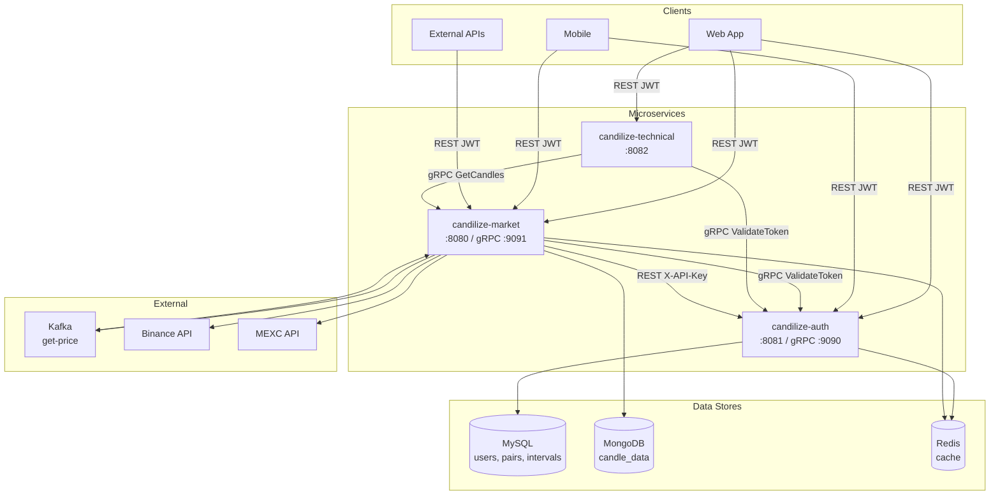
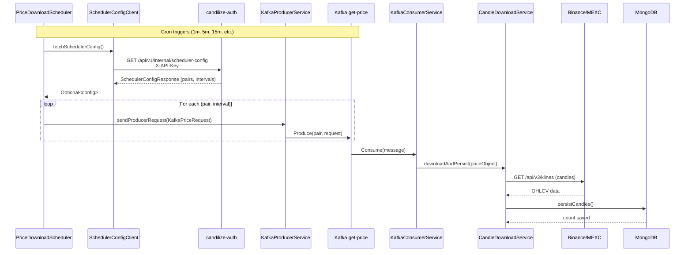
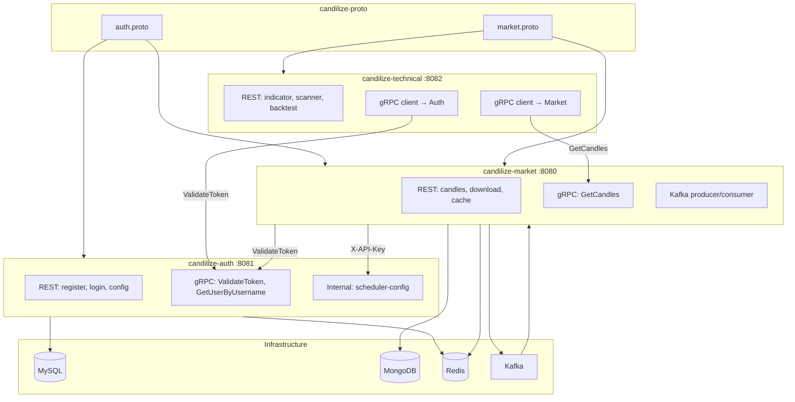
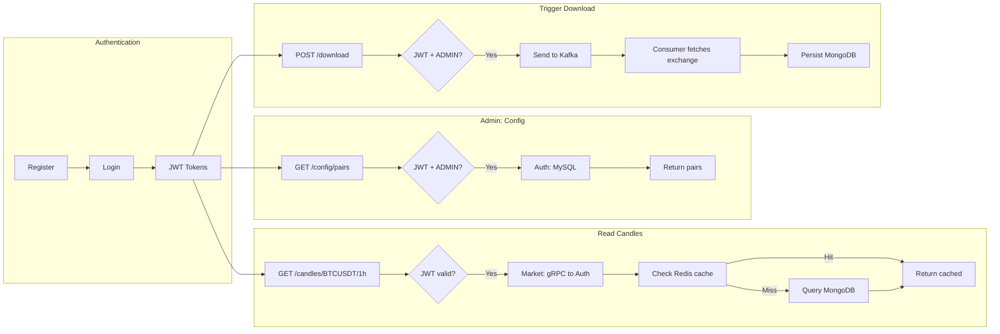

# Candilize — Architecture Diagrams

Mermaid diagrams for GitHub. These render automatically when viewing this file on GitHub.

---

## System Architecture (flowchart)

---

## Kafka Flow (sequenceDiagram)

---

## Microservices Overview (graph TD)

---

## User Journey (flowchart LR)

